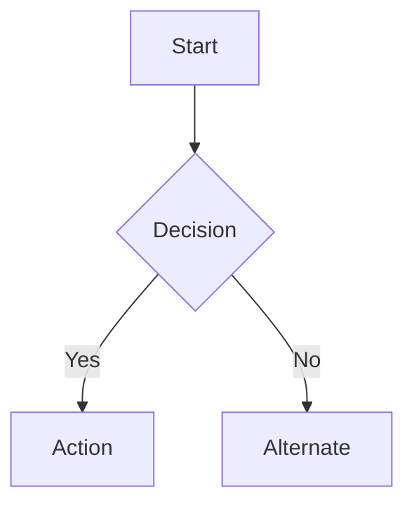

# Software Requirements Specification (SRS) — <Feature / Module>

| | |
|---|---|
| **Author** | <BA name> |
| **Status** | Draft / In Review / Approved |
| **Version** | 0.1 |
| **Last updated** | YYYY-MM-DD |
| **Related BRD** | <link> |

## 1. Purpose & Scope
What this feature does and its boundaries.

## 2. Actors & Roles
| Actor | Description | Permissions |
|-------|-------------|-------------|
| | | |

## 3. Functional Requirements
| ID | Requirement | Acceptance Criteria | Priority |
|----|-------------|---------------------|----------|
| FR-1 | | Given/When/Then ... | Must |
| FR-2 | | | Should |

## 4. User Flows
Describe or diagram the main flows (Mermaid recommended):

## 5. Screens / UI
| Screen | Purpose | Mockup link | Key elements |
|--------|---------|-------------|--------------|
| | | | |

## 6. Data Requirements
Entities, key fields, validation rules. Reference the ERD where relevant.

## 7. Non-Functional Requirements
- Performance: ...
- Security / permissions: ...
- Accessibility: ...

## 8. Dependencies
Other features, services, or APIs this relies on.

## 9. Out of Scope
- ...

## 10. Open Questions
- ...
